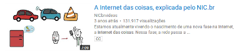
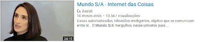
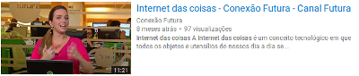
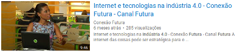

# AD01 - Introdução à Internet das Coisas

Objetivo: obter conhecimento introdutório ao assunto Internet das Coisas. 

**Passo 1**

Assista com atenção os vídeos abaixo:

**Passo 2**

De acordo com os vídeos que você acabou de assistir, fale sobre a Internet das Coisas. O que você entendeu sobre a IoT?  Fale sobre algum assunto que você achou importante/interessante sobre a IoT? Critique. 

