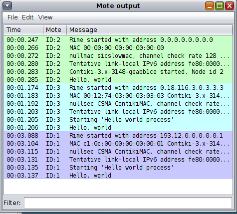
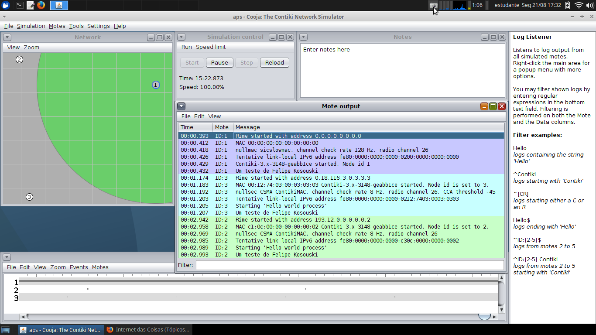
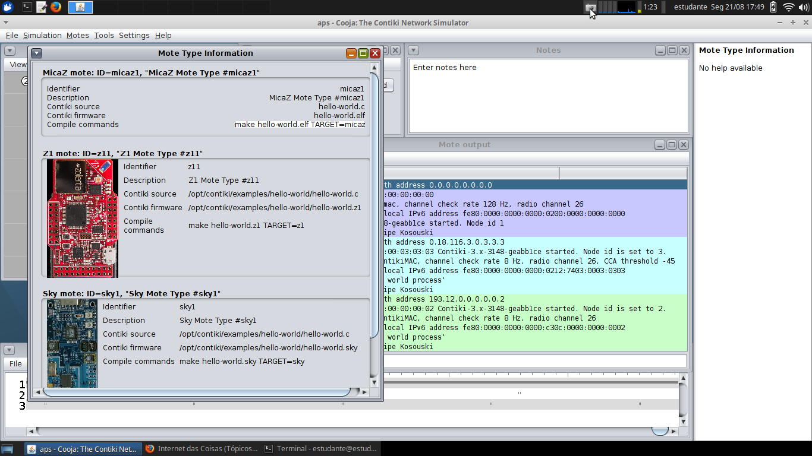
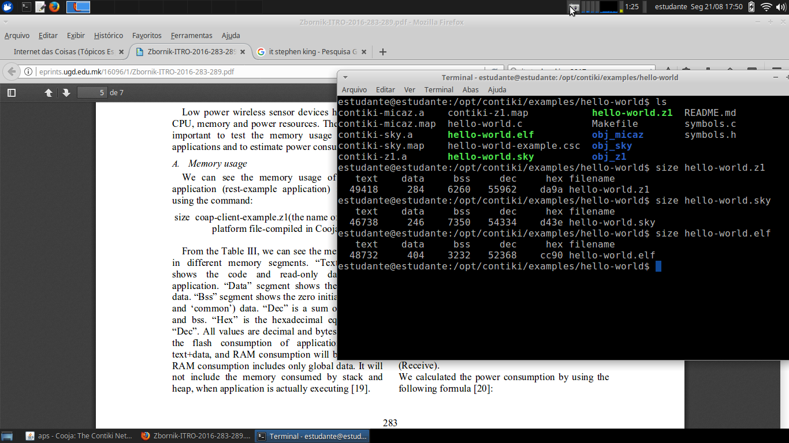

# AD02 - Simulação de Mote/Hardware da IoT

Objetivo: executar a simulação de hardwares MicaZ, TMoteSky e Z1 na ferramenta COOJA. E, ainda, descobrir qual a quantidade de memória necessária em um mote para executar um código em C. 

**Passo 1**

Instale a ferramenta [Cooja](https://docs.contiki-ng.org/en/develop/doc/tutorials/Running-Contiki-NG-in-Cooja.html).

**Passo 2**

Utilize um editor de texto qualquer (ou editor de código) e escreva o seguinte programa em C:

```
#include "contiki.h"
#include <stdio.h>
PROCESS(test_process, "test process");
AUTOSTART_PROCESSES(&test_process);
PROCESS_THREAD(test_process, ev, data)
{
  PROCESS_BEGIN();
  printf("Um teste de Fulano\n");
  PROCESS_END();
}
```

Altere "Fulano" para o seu nome.

Salve este código-fonte em um arquivo com a extensão ".c".

*Obs: código retirado do helloworld.c que acompanha o simulador.*

**Passo 3**

a) Abrir uma nova simulação na ferramenta Cooja;

b) Adicionar 3 motes na simulação (um MicaZ, um TMoteSky e um Z1);

c) Cada mote deverá carregar o seu código-fonte que criou no Passo 2.

d) Execute a simulação e faça uma captura de tela do texto impresso em cada um dos motes.

Exemplo:



**Passo 4**

Verifique a quantidade de memória FLASH e a quantidade de memória RAM que será utilizada para executar o seu código em cada um dos 3 motes.

Para entender como extrair essas informações leia a Seção V a) do artigo abaixo:
[Running and Testing Applications for Contiki OS Using Cooja Simulator](http://eprints.ugd.edu.mk/16096/1/Zbornik-ITRO-2016-283-289.pdf)

Qual a quantidade de memória FLASH e memória RAM será necessária para cada um dos motes? Qual dos três motes deverá dispor de mais memória para o seu código? 

<details><summary></summary>

Resolução por [Felipe Kosouski](https://www.linkedin.com/in/felipe-kosouski/)

z1
flash -> 49702
ram -> 6544

sky
flash -> 46984
ram -> 7596

micaZ
flash -> 49136
ram -> 3636

o Z1 e o micaZ precisarão de mais memória flash, enquanto que o sky é o que
utiliza menos flash. Porem, o micaZ é o que usará menos RAM.







