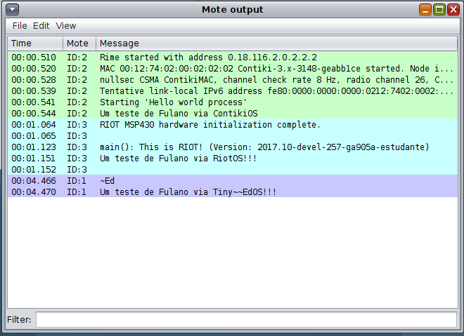
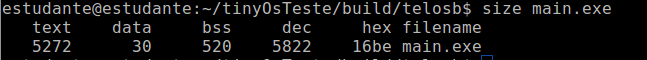
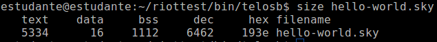
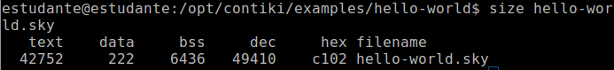
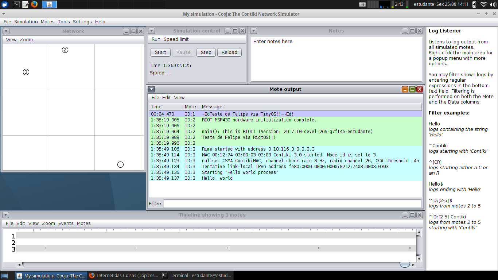

# AD03 - Sistemas Operacionais na IoT

Objetivo: executar diferentes sistemas operacionais de Internet das Coisas no simulador Cooja. 

**Passo 1**

Instale a ferramenta [Cooja](https://docs.contiki-ng.org/en/develop/doc/tutorials/Running-Contiki-NG-in-Cooja.html).

**Passo 2**

Preparar o Sistema Operacional TinyOS para rodar em um mote Sky.

Se você está utilizando o livelinux xbnet execute os seguintes passos para preparar o ambiente:

```
$ sudo apt-get update
$ sudo apt-get install tinyos-tools
export MAKERULES=/usr/src/tinyos/support/make/Makerules
export TOSDIR=/usr/src/tinyos/tos/
```

Em uma pasta no seu usuário crie os seguintes arquivos:

-> Makefile

```
COMPONENT=HelloWorldAppC
CFLAGS += -I$(TOSDIR)/lib/printf
include $(MAKERULES)
```

-> HelloWorldAppC.nc

```
#define NEW_PRINTF_SEMANTICS
#include "printf.h"
configuration HelloWorldAppC{
}
implementation {
  components MainC, HelloWorldC;
  components PrintfC;
  components SerialStartC;
  HelloWorldC.Boot -> MainC;
}
```

-> HelloWorldC.nc

```
#include "printf.h"
module HelloWorldC {
  uses {
    interface Boot;
  }
}
implementation {
  event void Boot.booted() {
     printf("Teste de Fulano via TinyOS!!!\n");
     printfflush();
  }
}
```

Substitua "fulano" pelo seu nome.

Em seguida compile para o Mote Sky (mesmo hardware de TelosB):

`$ make telosb`

Note que irá criar uma pasta "build" e nas suas subpastas você encontrará um arquivo "main.exe". Basta carregar este quando incluir um mote no Simulador Cooja.

Link para ajuda: [The TinyOS printf Library](http://tinyos.stanford.edu/tinyos-wiki/index.php/The_TinyOS_printf_Library).

Exemplo pronto pode ser encontrado após a instalação em `/usr/src/tinyos/apps/tutorials/Printf`.

**Passo 3**

Preparar o Sistema Operacional ContikiOS para rodar em um mote Sky.

-> Siga os mesmos passos da atividade anterior (AD02), apenas modifique a mensagem: "Teste de fulano via ContikiOS!!!\n".

**Passo 4**

Preparar o Sistema Operacional RiotOS para rodar em um mote Sky.

Se você está utilizando o livelinux xbnet execute os seguintes passos para preparar o ambiente:

```
$ sudo apt-get update
$ sudo apt-get install libc6-dev-x32
$ git clone https://github.com/RIOT-OS/RIOT.git
```

Possivelmente a base RIOT ficará em "/home/estudante/RIOT", então:

`$ export RIOTBASE=/home/estudante/RIOT/`

Crie os seguintes arquivos em uma pasta qualquer:

->Makefile

```
APPLICATION = hello-world
CFLAGS += -DDEVELHELP
include $(RIOTBASE)/Makefile.include
```

->main.c

```
#include <stdio.h>
int main(void)
{
    puts("Teste de fulano via RiotOS!!!\n");
    return 0;
}
```

Então, compile para o mote Sky (mesmo TelosB):

`$ make BOARD=telosb`

Assim será criada uma pasta `bin` e em suas subpastas você encontrará um arquivo `hello-world.elf`. Para carregar no Simulador Cooja, basta renomear este arquivo para `hello-world.sky`.

Link para ajuda: [Hands-on RIOT OS](https://recolog.blogspot.com/2016/04/hands-on-riot-os.html)

O código pode ser obtido no arquivo original em `/home/estudante/RIOT/examples/hello-world/`.

**Passo 5**

Faça uma captura de tela do Simulador Cooja rodando cada um dos três sistemas operacionais no mote Sky conforme a figura de exemplo:



**Passo 6**

Conforme a atividade anterior (AD02), identifique a quantidade de memória RAM e a quantidade de memória Flash que serão necessárias para rodar cada um dos códigos em um mote Sky e responda:

Qual dos três sistemas operacionais ocupará mais memória RAM em um mote Sky?

Qual dos três sistemas operacionais ocupará menos memória RAM em um mote Sky?

Qual dos três sistemas operacionais ocupará mais memória Flash em um mote Sky?

Qual dos três sistemas operacionais ocupará menos memória Flash em um mote Sky?

Obs: utilize o comando "size" do linux. 

<details><summary>Resolução:</summary>

Resolução por [Felipe Kosouski](https://www.linkedin.com/in/felipe-kosouski/)

Tiny OS
Ram -> 5302
Flash -> 550

Riot OS
Ram -> 5334
Flash -> 1128

Contiki OS
Ram -> 42974
Flash -> 6658

Qual dos três sistemas operacionais ocupará mais memória RAM em um mote Sky?
O sistema que ocupa mais memoria RAM é o Contiki.

Qual dos três sistemas operacionais ocupará menos memória RAM em um mote Sky?
O sistema que ocupa menos memória RAM é o Tiny OS

Qual dos três sistemas operacionais ocupará mais memória Flash em um mote Sky?
Novamente, o sistema que mais ocupa memoria flash é o Contiki

Qual dos três sistemas operacionais ocupará menos memória Flash em um mote Sky? 
E o que ocupa menos memória flash é o Tiny OS









</details>
