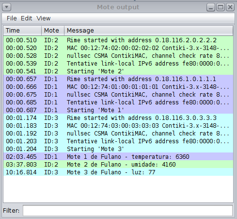
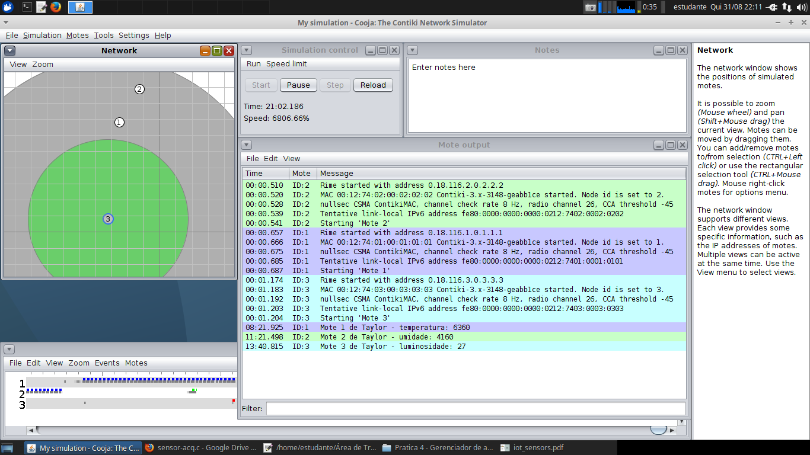

# AD04 - Sensores na IoT

Objetivo: configurar três motes para imprimir valores capturados de sensores. 

**Passo 1**

Instale a ferramenta [Cooja](https://docs.contiki-ng.org/en/develop/doc/tutorials/Running-Contiki-NG-in-Cooja.html)

**Passo 2 - Mote 1 - Sensor de Temperatura**

Utilize o código abaixo do sistema Contiki em um Mote Sky:

-> mote1.c

```
#include "contiki.h"
#include "dev/button-sensor.h"
#include "dev/sht11/sht11-sensor.h"
#include <stdio.h>
PROCESS(mote1_process, "Mote 1");
AUTOSTART_PROCESSES(&mote1_process);
PROCESS_THREAD(mote1_process, ev, data)
{
  static int val;
  PROCESS_BEGIN();
  SENSORS_ACTIVATE(button_sensor);
  SENSORS_ACTIVATE(sht11_sensor);
  PROCESS_WAIT_EVENT();
  val = sht11_sensor.value(SHT11_SENSOR_TEMP);
  printf("Mote 1 de Fulano - temperatura: %d\n",val);
  SENSORS_DEACTIVATE(button_sensor);
  SENSORS_DEACTIVATE(sht11_sensor);
  PROCESS_END();
}
```

Substitua "Fulano" pelo seu nome.

**Passo 3 - Mote 2 - Sensor de Umidade**

Assim como no passo anterior, crie um segundo mote para imprimir o valor do sensor de umidade.

Encontre ajuda: [Sensor Acquisition](https://anrg.usc.edu/contiki/index.php/Sensor_acquisition)

*Obs: não há necessidade de fazer a conversão do valor a ser impresso.*

**Passo 4 - Mote 3 - Sensor de Luz**

Assim como no passo anterior, crie um terceiro mote para imprimir o valor do sensor de luz.

Encontre ajuda: [Sensor Acquisition](https://anrg.usc.edu/contiki/index.php/Sensor_acquisition)

*Obs: não há necessidade de fazer a conversão do valor a ser impresso.*

**Passo 5**

Carregue os três motes dos passos 3, 4 e 5 no simulador Cooja em hardware Mote Sky.

Inicie a simulação e clique no button-sensor de cada um dos motes.

Note que a saída dos motes será semelhante a esta:



<details><summary>Resolução:</summary>

Resolução por [Taylor Sobjak](https://www.linkedin.com/in/taylorsobjak/):

[mote1.c](mote1.c)

[mote2.c](mote2.c)

[mote3.c](mote3.c)



</details>
