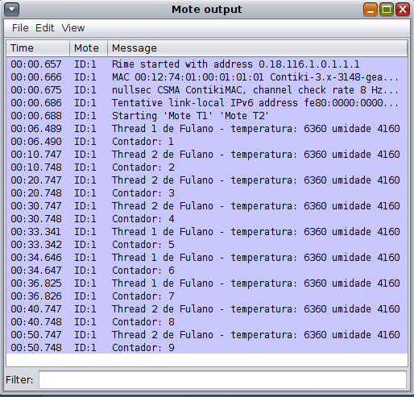
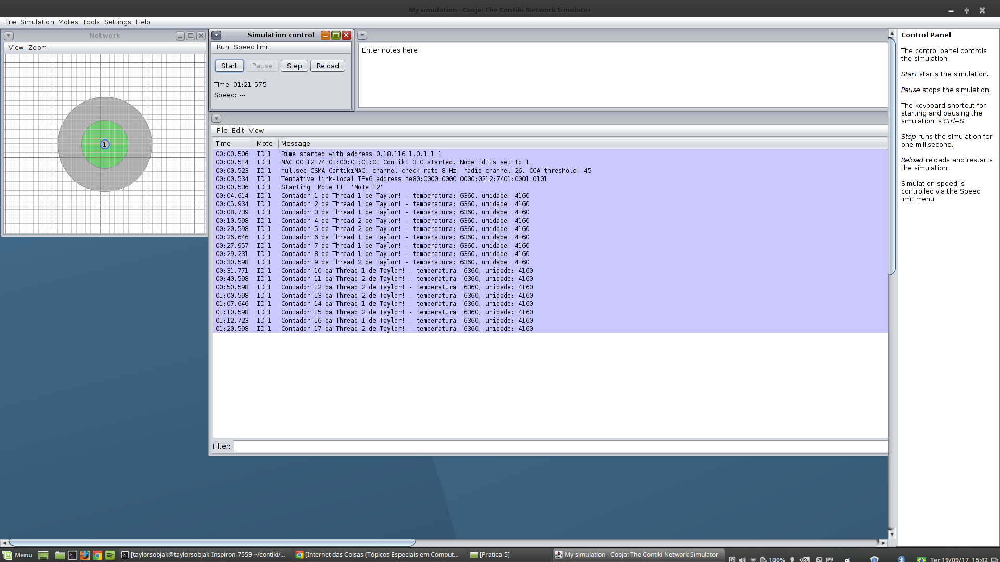

# AD05 - Programação de Nós na IoT

Objetivo: compreender a codificação em C de um nó.

**Passo 1**

Instale a ferramenta [Cooja](https://docs.contiki-ng.org/en/develop/doc/tutorials/Running-Contiki-NG-in-Cooja.html).

**Passo 2 - Programar duas Threads**

[Slides usados em aula](iot_programacao.pdf).

Utilize o código abaixo do sistema Contiki em um Mote Sky:

-> mote.c

```
#include "contiki.h"
#include <stdio.h>
PROCESS(t1_process, "Mote T1");
PROCESS(t2_process, "Mote T2");
AUTOSTART_PROCESSES(&t1_process,&t2_process);
PROCESS_THREAD(t1_process, ev, data)
{
  PROCESS_BEGIN();
  printf("Thread 1 de Fulano!\n");
  PROCESS_END();
}
PROCESS_THREAD(t2_process, ev, data)
{
  PROCESS_BEGIN();
  printf("Thread 2 de Fulano!\n");
  PROCESS_END();
}
```

Substitua "Fulano" pelo seu nome.

Execute no simulador Cooja (Sugestão: ajuste speed limit para 100%).

Retirado de [Contiki - Processes](https://github.com/contiki-os/contiki/wiki/Processes).

**Passo 3 - Button/Timers em laço de repetição**

Modifique o seu código para que a Thread 1 imprima a cada clique acionado no botão sensor.
Modifique, também, a Thread 2 para que imprima a cada 10 segundos.

-> mote.c

```
#include "contiki.h"
#include "dev/button-sensor.h"
#include <stdio.h>
PROCESS(t1_process, "Mote T1");
PROCESS(t2_process, "Mote T2");
AUTOSTART_PROCESSES(&t1_process,&t2_process);
PROCESS_THREAD(t1_process, ev, data)
{
  PROCESS_BEGIN();
  SENSORS_ACTIVATE(button_sensor);
  while(1)
  {
    PROCESS_WAIT_EVENT();
    if(ev == sensors_event && data == &button_sensor)
    {
      printf("Thread 1 de Fulano!\n");
    }
  }
  SENSORS_DEACTIVATE(button_sensor);
  PROCESS_END();
}
PROCESS_THREAD(t2_process, ev, data)
{
  PROCESS_BEGIN();
  static struct etimer et;
  etimer_set(&et, CLOCK_SECOND * 10);
  while (1)
  {
     PROCESS_WAIT_EVENT();
     if (etimer_expired(&et))
     {
        printf("Thread 2 de Fulano!\n");
        etimer_reset(&et);
     }
  }
  PROCESS_END();
}
```

Execute no simulador Cooja.

Retirado de [Contiki - The Etimer Library](https://github.com/contiki-os/contiki/wiki/Timers#The_Etimer_Library).

**Passo 4 - Utilizar variável para contabilizar**

Contabilize cada vez que uma Thread imprimir o texto.

-> mote.c

```
#include "contiki.h"
#include "dev/button-sensor.h"
#include <stdio.h>
PROCESS(t1_process, "Mote T1");
PROCESS(t2_process, "Mote T2");
AUTOSTART_PROCESSES(&t1_process,&t2_process);
PROCESS_THREAD(t1_process, ev, data)
{
  PROCESS_BEGIN();
  static int contador = 0;
  SENSORS_ACTIVATE(button_sensor);
  while(1)
  {
    PROCESS_WAIT_EVENT();
    if(ev == sensors_event && data == &button_sensor)
    {
      contador = contador + 1;
      printf("Contador %u da Thread 1 de Fulano!\n", contador);
    }
  }
  SENSORS_DEACTIVATE(button_sensor);
  PROCESS_END();
}
PROCESS_THREAD(t2_process, ev, data)
{
  PROCESS_BEGIN();
  static int contador = 0;
  static struct etimer et;
  etimer_set(&et, CLOCK_SECOND * 10);
  while (1)
  {
     PROCESS_WAIT_EVENT();
     if (etimer_expired(&et))
     {
        contador = contador + 1;
        printf("Contador %u da Thread 2 de Fulano!\n", contador);
        etimer_reset(&et);
     }
  }
  PROCESS_END();
}
```

Execute o código no simulador Cooja.

Pesquisar: Local and Global variables.

**Passo 5 - Modificar**

Modifique o seu código para atender o seguinte:

a) Ao invés de imprimir um texto qualquer imprima o resultado da coleta do sensor de temperatura e do sensor de umidade;

b) Contabilize cada vez que o mote imprimir o resultado da coleta dos sensores, seja via clique no sensor botão ou seja ao expirar o tempo de 10 segundos;

c) Mantenha a impressão do seu nome (Fulano).

O resultado deverá ser semelhante à figura apresentada abaixo: 



<details><summary>Resolução:</summary>

Resolução por [Taylor Sobjak](https://www.linkedin.com/in/taylorsobjak/):

[mote.c](mote.c)


</details>
