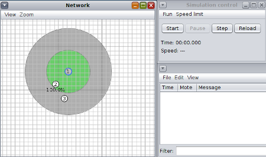

# AD10 - IoT com 6LoWPAN e UDP

Objetivo: aprender a configurar uma rede IoT com o protocolo RPL e fazer a comunicação entre os nós com o protocolo UDP. 

**Passo 1 - Codificar**

Em uma pasta qualquer criar três arquivos para o código-fonte dos três nós, sugestão:

Nó 1: sink.c
Este será o nó raiz do protocolo RPL, ou seja, irá configurar a topologia de roteamento.

Nó 2: sender.c
Este será o nó que irá enviar mensagens com o protocolo UDP ao nó receiver.c.

Nó 3: receiver.c
Este será o nó que irá receber e apresentar as mensagens recebidas com o protocolo UDP.

Você pode usar o código esqueleto para começar a codificar:

```
#include "contiki.h"

#include <stdio.h>

PROCESS(skel_process, "Skel process");

AUTOSTART_PROCESSES(&skel_process);

PROCESS_THREAD(skel_process, ev, data)

{

  PROCESS_BEGIN();

  printf ("Esqueleto funcionando!\n");

  PROCESS_END();

}
```

**Passo 2 - Compilar o Projeto**

Na mesma pasta, crie um arquivo chamado "Makefile":

```
CONTIKI_PROJECT = sink sender receiver

all: $(CONTIKI_PROJECT)

CONTIKI = /opt/contiki/

include $(CONTIKI)/Makefile.include 
```

Note que neste arquivo deve conter os códigos do projeto na 1a linha e confira se o caminho da pasta do Contiki está correto na 3a linha.

Agora você pode compilar todo o projeto com uma linha de comando:

`$ make TARGET=z1`

Sugestão: sempre que modificar o código do projeto, compile antes na linha de comando para evitar que erros levem ao travamento do simulador.

**Passo 3 - Simular**

Carregue e execute o projeto no simulador COOJA.



- Adicione Motes do tipo Z1, e para cada Mote selecione o código-fonte correspondente.
- Verifique se os nós possuem alcance entre eles, pois poderão não se comunicar.
- Você pode salvar a sua simulação, se quiser, na mesma pasta.

Slides para compreender [6LoWPAN](6lowpan.pdf).

**Passo 4 - Endereçamento dos Nós**

Para os nós receberem um endereço IP é preciso incluir as seguintes bibliotecas.

```
...

#include "net/ip/uip.h"

#include "net/ipv6/uip-ds6.h"

...

```

**Passo 5 - Endereçamento estático**

Caso queira atribuir um endereço IP dinamicamente, pule este passo e siga no Passo 7.

Caso queira atribuir um endereço IP estático, configure:


```
... (no processo ou chamar função)

   static uip_ipaddr_t ipaddr;

   uip_ip6addr(&ipaddr, 0x0, 0x0, 0x0, 0x0, 0x0, 0x0, 0x0, 0x0);

   uip_ds6_addr_add(&ipaddr, 0, ADDR_MANUAL); 

...
```

Note que o endereço IPv6 está zerado, você deve decidir como endereçar cada um dos nós.

**Passo 6 - Roteamento com RPL**

Slides para compreender [RPL](rpl.pdf).

Por padrão os nós já estão rodando RPL, basta definir o nó raiz. Configure o nó 1 (sink.c).

```
...

#include "net/rpl/rpl.h" 

... (após endereçamento)

   rpl_set_root(RPL_DEFAULT_INSTANCE,(uip_ip6addr_t *)&ipaddr); 

...

```

Pule o Passo 7 e siga no Passo 8, pois o passo 7 é para quem optou fazer endereçamento dinâmico.

**Passo 7 - Roteamento com RPL e Endereçamento dinâmico**

Por padrão os nós já estão rodando RPL, basta definir o nó raiz. Configure o nó 1 (sink.c).

```
...

#include "net/rpl/rpl.h" 

... (logo após iniciar o processo)

  uip_ipaddr_t ipaddr;

  rpl_dag_t *dag;

  uip_ip6addr(&ipaddr, 0x0, 0x0, 0x0, 0x0, 0x0, 0x0, 0x0, 0x0);

  dag = rpl_set_root(RPL_DEFAULT_INSTANCE,(uip_ip6addr_t *)&ipaddr);

  rpl_set_prefix(dag, &ipaddr, 64);

...

```

Importante:
- É preciso atribuir um prefixo para os nós que irão receber um endereço IPv6 (está zerado).

**Passo 8 - Enviar mensagens por UDP**

Configure o nó 2 para enviar mensagens utilizando UDP (sender.c):

```
...

#include "net/ip/uip-udp-packet.h" 

... (após endereçamento ou em uma função)

   static uip_ipaddr_t remote_ipaddr;

   uip_ip6addr(&remote_ipaddr, 0x0, 0x0, 0x0, 0x0, 0x0, 0x0, 0x0, 0x0); 

   static struct uip_udp_conn *client_udp;

   client_udp = udp_new(NULL,0,NULL); #faltou esta linha (08/11)

   static char buf[30];

   sprintf(buf, "TESTE");

   uip_udp_packet_sendto(client_udp,buf,

                         strlen(buf),

                         &remote_ipaddr,

                         UIP_HTONS(5000));

...

```

Importante:
- Endereço IPv6 remoto está zerado (configure o IP do nó 3)
- Porta de destino está configurada como 5000
- Tamanho da mensagem está limitada para 30 caracteres
- Mensagem "TESTE" será enviada

Sugestão:
- Aguarde alguns segundos antes de enviar a mensagem UDP, pois o protocolo RPL precisa de tempo para convergência. (código no passo 10)

**Passo 9 - Receber e imprimir mensagem de UDP**

Configure o nó 3 (receiver.c) para receber e imprimir as mensagens via UDP:

```
...

#include "net/ip/uip-udp-packet.h" 

... (após endereçamento ou em uma função)

   static struct uip_udp_conn *udp_server;

   udp_server = udp_new(NULL,0,NULL);

   udp_bind(udp_server, UIP_HTONS(5000));

... (aguardar um evento)

      if(ev == tcpip_event) {

         static char *appdata;

         appdata = (char *)uip_appdata;

         appdata[uip_datalen()] = 0;

         printf("%s \n",appdata);

      } 

...

```

Importante:
- Serviço UDP configurado na porta 5000

**Passo 10 - Configurações opcionais:**

No passo 5 pode ser interessante associar o endereço IPv6 ao número do nó durante a simulação, pode-se utilizar o node_id:

```
...

#include "sys/node-id.h" 

...

   printf("id deste no: %d \n",node_id);

...

```

No passo 8 certamente a mensagem via UDP será enviada antes da configuração do protocolo RPL, então é possível aguardar um pouco antes de enviar a mensagem:

```
...

   static struct etimer et;

   etimer_set(&et, 15 * CLOCK_SECOND);

   PROCESS_YIELD(); 

... (enviar mensagem)

```

Se não houver necessidade de economizar energia do nó é possível desabilitar o modo RDC (Radio Duty Cycle):

```
...

   NETSTACK_RDC.off(1); 

...

```

**Passo 11 - Resolva:**

Modifique o seu código para atender o seguinte:
- Cada vez que o sensor "button" for clicado no nó 2 (sender) este deverá enviar um segmento UDP para o nó 3 (receiver).
- O nó 3 (receiver), por sua vez, ao receber um segmento UDP deverá acender ou apagar os seus LEDs.

Veja um exemplo no vídeo: [Exemplo de Roteamento](https://www.youtube.com/watch?v=nZo3xaAlU60)

<details><summary>Resolução:</summary>

Resolução por [Taylor Sobjak](https://www.linkedin.com/in/taylorsobjak/):

[Contiki - Cooja - Atividade Roteamento](https://www.youtube.com/watch?v=3uGlhN2TUJM)

</details>

