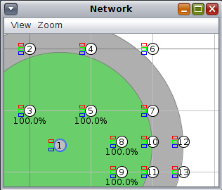

# AD11 - Roteamento de Borda na IoT

Objetivo: configurar o border router para a Internet das Coisas e interagir com os objetos inteligentes. 

**Passo 1**

Faça o Download da atividade 11 e carregue no simulador Cooja.

[atividade11.tar.gz](atividade11.tar.gz)

Observe o seguinte:
- Nó 1 roteador - sink/border router
- Nós 2 ao 4 - nós folhas

**Passo 2**

Configurar o nó de número 1 como o border router da topologia.
- Clique com o botão direito sobre o nó 1
- Selecione "Mote tools for Z1 1"
- Selecione "Serial Socket (SERVER)"
- Clique em "Start"

Note que haverá uma porta aberta com o hospedeiro (127.0.0.1:60001)

**Passo 3**

Configurando o túnel do Nó 1 com o Hospedeiro:

Mas antes alguns ajustes:

Mude para root:

`$ sudo su`

Acesse a pasta:

`# cd /opt/contiki/tools`

Edite o arquivo:

```
# mousepad tunslip6.c
   Adicione o include:
   #include <sys/time.h>
   E comente a seguinte linha:
   //b_rate = select_baudrate(baudrate);
```

Salvar e sair.

Compile:

`# cc tunslip6.c -o tunslip6`

Execute:

`# ./tunslip6 -a 127.0.0.1 -p 60001 cafe::1/64`

Note que será criado um túnel entre o nó 1 e o hospedeiro:

`# ifconfig tun0`

**Passo 4** 

Inicie a simulação no COOJA e verifique:
- Endereços IPs dos nós
- É possível alcançar os nós através do hospedeiro (utilize o comando ping6)

**Passo 5**

Faça um script em python para enviar mensagens aos nós:

Exemplo "mensagem.py":

```
import socket

address = "cafe::2" 

port = 5000

message = str.encode('TESTE')

sock = socket.socket(socket.AF_INET6,socket.SOCK_DGRAM)

sock.sendto(message, (address, port))
```

Execute o script e verifique se funcionou.

**Passo 6**

Tente reproduzir a topologia da figura abaixo:



Observe o seguinte:

Simule uma casa inteligente (smart home) na qual os interruptores se comunicam com as lâmpadas vi Internet das Coisas.

- Nó 1 roteador - sink/border router
- Nós 2 ao 7 - leds simulam lâmpadas
- Nós 8 ao 13 - botões simulam interruptores

A imagem sugere uma topologia, mas faça como bem entender desde que haja ao menos 10 nós na sua topologia.

Exemplo de funcionamento: ao clicar o botão do nó número 8, este deverá acender/apagar os leds do nó número 2.

**Passo 7**

Escreva um código que se comunique com a casa inteligente via UDP. O seu código pode ser em qualquer linguagem de programação (nosso exemplos são em python). O usuário do seu sistema poderá escolher qual led/lâmpada para acender/apagar.

Sugestão: faça um menu para o usuário selecionar, ou passe o código do led/lâmpada via parâmetros na linha de comando.

Vídeo de exemplo: [Exemplo de Roteamento de Borda](https://www.youtube.com/watch?v=vZrrI-VRS38)

<details><summary>Resolução:</summary>

Resolução por [Taylor Sobjak](https://www.linkedin.com/in/taylorsobjak/).

[Contiki - Cooja - Atividade Roteamento Borda](https://www.youtube.com/watch?v=s1liCiR_0GM)
</details>
