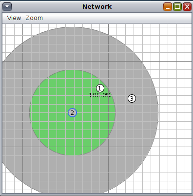

# AD12 - Comunicação Web na IoT

Objetivo: além de configurar o Border Router, interagir com os objetos inteligentes via WEB através do protocolo CoAP. 

**Passo 1**

Faça o Download da atividade 12 e carregue no simulador COOJA.



[atividade12.tar.gz](atividade12.tar.gz)

Observe o seguinte:
- Nó 1 - Roteador
- Nó 2 - Web Server
- Nó 3 - Web Client

**Passo 2**

Configurar o nó de número 1 como o border router da topologia.
- Clique com o botão direito sobre o nó 1
- Selecione "Mote tools for Z1 1"
- Selecione "Serial Socket (SERVER)"
- Clique em "Start"

Note que haverá uma porta aberta com o hospedeiro (127.0.0.1:60001)

**Passo 3**

Configurando o túnel do Nó 1 com o Hospedeiro:

Mas antes alguns ajustes:

Mude para root:

`$ sudo su`

Acesse a pasta:
`# cd /opt/contiki/tools`

Edite o arquivo:

```
# mousepad tunslip6.c
   Adicione o include:
   #include <sys/time.h>
   E comente a seguinte linha:
   //b_rate = select_baudrate(baudrate);
   Salve e saia.
```

Compile:

`# cc tunslip6.c -o tunslip6`

Execute:

`# ./tunslip6 -a 127.0.0.1 -p 60001 cafe::1/64`

Note que será criado um túnel entre o nó 1 e o hospedeiro:

`# ifconfig tun0`

**Passo 4**

Inicie a simulação no COOJA e verifique:
- Endereços IPs dos nós
- É possível alcançar os nós através do hospedeiro (utilize o comando ping6)
- Note que agora o protocolo da aplicação não é mais UDP, mas sim CoAP

**Passo 5**

Verifique o código-fonte:
- webserver.c (Quais são os caminhos? URI?)
- webclient.c (Quais URIs eles acessam?)

Note que há uma pasta "resources" com os recursos web disponíveis.

Material adicional de consulta pode ser visto em: `/opt/contiki/examples/er-rest/example/`.

**Passo 6**

Acesso via Navegador Firefox:

Instale o plugin Copper.

Digite a URL, exemplo:

`coap://[cafe::2]/`

Navegue nas opções.

**Passo 7**

Instale as libs aiocaop para utilizar no Python:

`$ sudo apt-get update`

`$ sudo apt-get install python3-aiocoap`

**Passo 8**

Faça um script python para buscar o "Hello World" de uma lâmpada.

hello.py

```
import logging

import asyncio

from aiocoap import *

logging.basicConfig(level=logging.INFO)

@asyncio.coroutine

def main():

    protocol = yield from Context.create_client_context()

    request = Message(code=GET)

    request.set_request_uri('coap://[cafe::2]/hello')

    try:

        response = yield from protocol.request(request).response

    except Exception as e:

        print('Failed to fetch resource:')

        print(e)

    else:

        print('Result: %s\n%r'%(response.code, response.payload))

if __name__ == "__main__":

   asyncio.get_event_loop().run_until_complete(main())
```

**Passo 9 - Resolver:**

Continue esta atividade resolvendo o seguinte:

a) Ao invés de imprimir "Hello World", imprima o seu nome ao solicitar pelo recurso "hello";

b) Crie um recurso "toggle" que altere os status dos LEDs quando solicitado;

c) Modifique os clientes:
- Nó WebClient: ao clicar o button, requisitar tanto "hello" como "toggle";
- Script Python: opção  para requisitar tanto "hello" como "toggle";
- Navegador: apenas testar as requisições.

Vídeo de exemplo: [Exemplo Web Server](https://www.youtube.com/watch?v=baXPIlzjevs)

<details><summary>Resolução:</summary>

Resolução por [Felipe Kosouski](https://www.linkedin.com/in/felipe-kosouski/):

[Contiki - Cooja - Atividade Web](https://www.youtube.com/watch?v=3iLSoM3YR8M)

Resolução por [Taylor Sobjak](https://www.linkedin.com/in/taylorsobjak/):

[Contiki - Cooja - Atividade Web II](https://www.youtube.com/watch?v=IlDbXFWgDyo)
</details>
