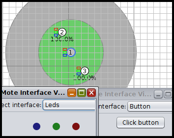
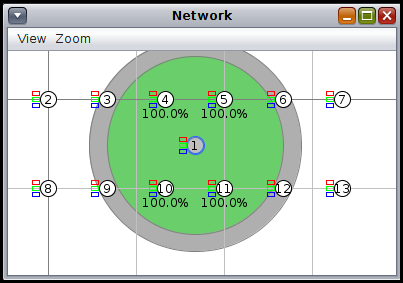

# AD13 - Lâmpadas - Smart Home

Objetivo: criar uma aplicação externa para gerenciar as lâmpadas (simuladas) de uma casa inteligente. 

**Passo 1**

Faça o Download da atividade 13 e carregue no simulador Cooja.



[atividade13.tar.gz](atividade13.tar.gz)

Observe o seguinte:
- Nó 1 - Roteador
- Nó 2 - Web Server (simula uma lâmpada)
- Nó 3 - Web Client (simula um interruptor)

**Passo 2**

Configurar o nó de número 1 como o border router da topologia.
- Clique com o botão direito sobre o nó 1
- Selecione "Mote tools for Z1 1"
- Selecione "Serial Socket (SERVER)"
- Clique em "Start"

Note que haverá uma porta aberta com o hospedeiro (127.0.0.1:60001)

**Passo 3**

Configurando o túnel do Nó 1 com o Hospedeiro:

Mas antes alguns ajustes:

Mude para root:

`$ sudo su`

Acesse a pasta:

`# cd /opt/contiki/tools`

Edite o arquivo:

```
# mousepad tunslip6.c
   Adicione o include:
   #include <sys/time.h>
   E comente a seguinte linha:
   //b_rate = select_baudrate(baudrate);
   Salve e saia.
```

Compile:

`# cc tunslip6.c -o tunslip6`

Execute:

`# ./tunslip6 -a 127.0.0.1 -p 60001 cafe::1/64`

Note que será criado um túnel entre o nó 1 e o hospedeiro:

`# ifconfig tun0`

**Passo 4**

Inicie a simulação no Cooja e verifique:
- Endereços IPs dos nós
- É possível alcançar os nós através do hospedeiro (utilize o comando ping6)
- Note que agora o protocolo da aplicação não é mais UDP, mas sim CoAP

**Passo 5**

Verifique o código-fonte:
- lampada.c (Quais são os caminhos? URI?)
- interruptor.c (Quais URIs eles acessam?)

Note que há uma pasta "resources" com os recursos web disponíveis.

Material adicional de consulta pode ser visto em: `/opt/contiki/examples/er-rest/example/`.

**Passo 6**

Instale as libs aiocaop para utilizar no Python:

`$ sudo apt-get update`

`$ sudo apt-get install python3-aiocoap`

**Passo 7**

Faça um script python para buscar o status de uma lâmpada.

status.py

```
import logging

import asyncio

from aiocoap import *

logging.basicConfig(level=logging.INFO)

@asyncio.coroutine

def main():

    protocol = yield from Context.create_client_context()

    request = Message(code=GET)

    request.set_request_uri('coap://[cafe::2]/actuators/ledstatus')

    try:

        response = yield from protocol.request(request).response

    except Exception as e:

        print('Failed to fetch resource:')

        print(e)

    else:

        print('Result: %s\n%r'%(response.code, response.payload))

if __name__ == "__main__":

   asyncio.get_event_loop().run_until_complete(main())
```

Fonte: GitHub aiocoap

**Passo 8**

Faça um script python para alterar o status de uma lâmpada.

toggle.py

```
import logging

import asyncio

from aiocoap import *

logging.basicConfig(level=logging.INFO)

@asyncio.coroutine

def main():

    protocol = yield from Context.create_client_context()

    request = Message(code=POST)

    request.set_request_uri('coap://[cafe::2]/actuators/toggle')

    try:

        response = yield from protocol.request(request).response

    except Exception as e:

        print('Failed to fetch resource:')

        print(e)

    else:

        print('Result: %s\n%r'%(response.code, response.payload))

if __name__ == "__main__":

   asyncio.get_event_loop().run_until_complete(main())
```

Fonte: GitHub aiocoap

**Passo 9 - Resolver:**

9.a) Simule uma casa inteligente com no mínimo 4 lâmpadas. A figura abaixo ilustra um exemplo com 6 lâmpadas.



Observe:
- Nó 1 - Roteador
- Nós 2 ao 7 - Lâmpadas
- Nós 8 ao 13 - Interruptores (opcional)

9.b) Crie uma aplicação externa para controlar as lâmpadas da casa inteligente:
- A aplicação pode ser feita em qualquer linguagem de programação, pode ser no modo texto ou no modo gráfico;
- A comunicação da aplicação com os motes pode ser via UDP ou via COAP;
- A aplicação deverá apresentar o nome do aluno autor;
- A aplicação deverá apresentar os status de todas as lâmpadas (ex.: uma lista);
- A aplicação deverá permitir ligar/desligar uma lâmpada qualquer;
- A aplicação deverá ter uma opção especial para ligar/desligar todas as lâmpadas de uma vez.

Vídeo de exemplo: [Exemplo SmartHome](https://www.youtube.com/watch?v=z_12WtTrMSg).

<details><summary>Resolução:</summary>

Resolução por [Taylor Sobjak](https://www.linkedin.com/in/taylorsobjak/):

[Contiki - Cooja - Atividade Smart Home](https://www.youtube.com/watch?v=ym4fF3XKZ3w)

</details>
